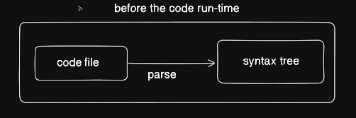
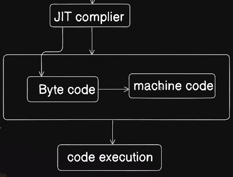

# code file>> parsing >> syntaxTree

What is the process of collecting keywords from the code file to create a structure called?

Tokenization is the process of breaking down code into smaller components, or tokens, such as keywords, operators, and identifiers, which facilitates easier analysis and processing of the code structure.

What is the primary purpose of the syntax tree in JavaScript code execution?

To organize and structure the code before execution," is correct because a syntax tree helps model the hierarchical relationships in the code, enabling the interpreter to understand and execute the code accurately. 

JIT Compiler - Just In Time Compiler which is an inbuilt part of a node js- An tis node js take all of your code and convert into Byte code and then Machine Code when required - this called byte code translation.

Now since all of your code is a byte code and now you don't need to actually worry about the speed of the code, it's already almost there and it can be easily quickly converted into machine code whenever it is required. You click on the button, you click on a login, you hit the submit button, that all can be done much more faster and that is your code execution part.

Lastly ; Code Execution!!
=====================================

But it's not just node.js. There are other such frameworks and not frameworks but other such softwares which can execute your JavaScript like we have bun, we have Deno.

Some of them are based on Veight engine like node, but there are other code execution engines as well.

So there's a JavaScript core as well, which is almost equal like Veight engine, but a different approach of executing it.

So if you're going to go ahead and look for these other softwares, like for example, there's very popular is bun -this is also another JavaScript runtime all in one toolkit.

