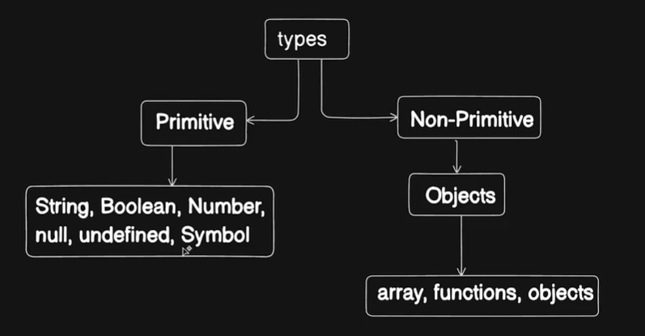

## dataTypes

We are still on to the phase of, how we manage the data, store the data in the memory or in the programming itself.

- Primitive
  - String
  - Boolean
  - Number
  - null
  - undefined
  - Symbol

- Non-Primitive
  - objects
    - array, fuctions, objects

* typeof()
